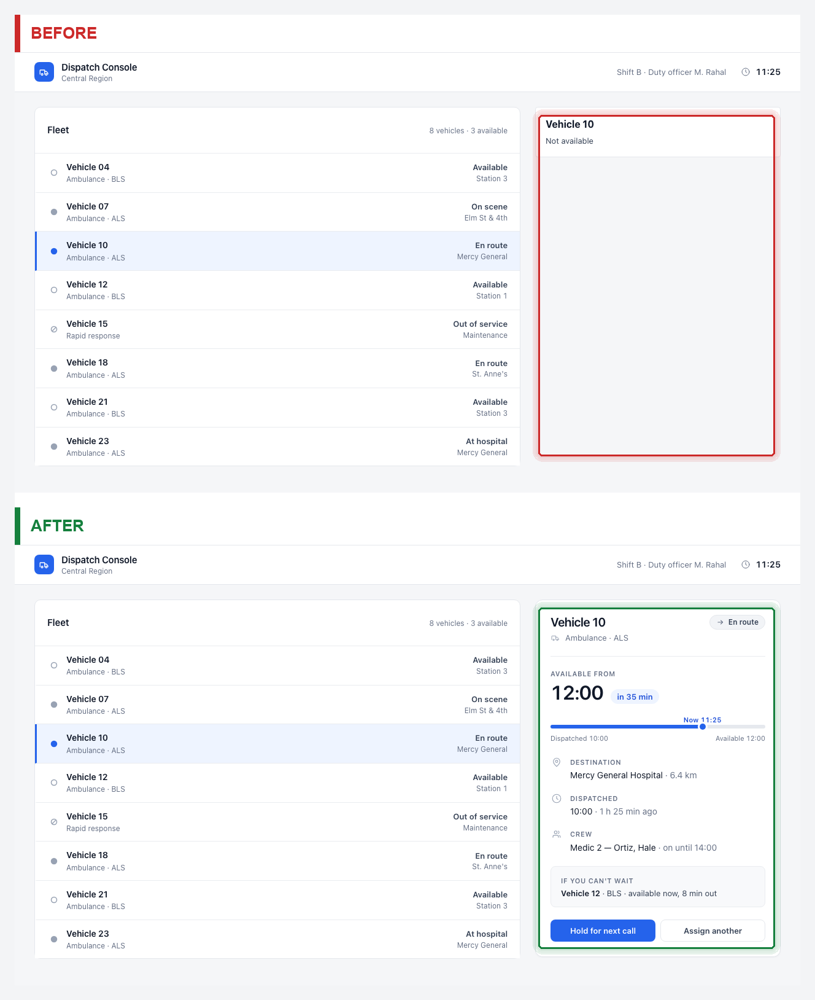
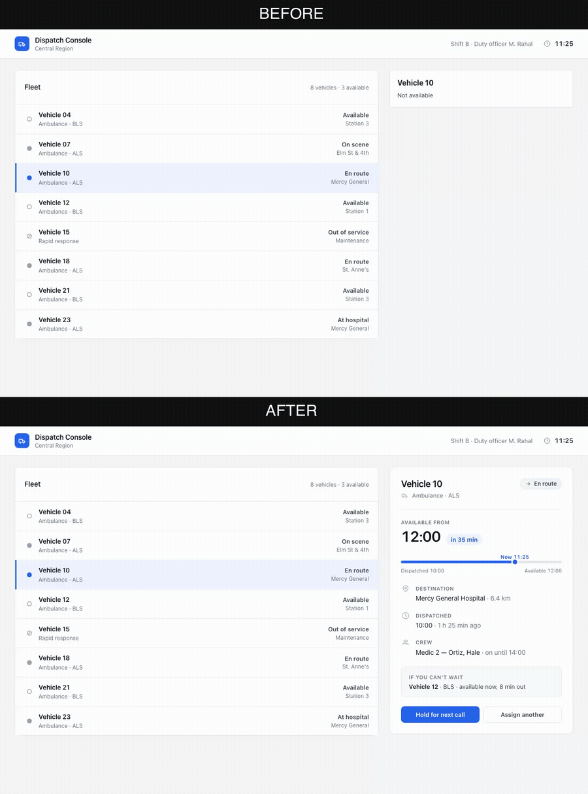

# proof-of-fix

Two Claude Code skills for reviewing UI work you delegated, without having to navigate
the application yourself to take before and after screenshots.

You ask for a change and you ask for proof. Claude records the screen as it is now, makes
the change, replays exactly the same steps afterwards, and leaves a video, a set of
annotated stills and a machine-checked verdict on disk. You look at them and decide
whether the work is done.



The red and green boxes are not drawn by hand. They come from a thresholded pixel diff of
the two screenshots, so the marked region is by construction the region that changed.

This is the run those stills came from — the same interaction replayed against both
versions, stacked and labelled by the pipeline:



Reduced to 900 px and 12 fps for this page. The recording itself is
[`docs/example/before-after.mp4`](docs/example/before-after.mp4), 1280x1728, 3.7 s.

Both are reproducible from this repository: the two pages are in
[`docs/example/dispatch-console/`](docs/example/dispatch-console), and the comment the
pipeline generated for the run is
[`docs/example/proof-comment.md`](docs/example/proof-comment.md).

## Review an agent's fix

A code diff shows how an agent implemented a UI change, but not which interaction it
tested or what a user sees afterward. Checking that manually means running the
application, recreating the original state and repeating the relevant steps.

`proof-of-fix` records that work as a before/after review artifact. The video shows the
interaction the agent exercised, the context and zoom stills make the visible change easy
to inspect, and the assertions verify the states reached during both runs. This lets the
developer who delegated the fix understand and validate the result without reconstructing
the entire scenario by hand.

## What you actually do

Twice, once per project: install it, then run `/proof-of-fix-setup` and answer a handful
of questions about your app. Both are described below.

After that it is conversation. You say something like:

> The vehicle detail panel only shows "Not available" — a dispatcher can't tell when the
> vehicle frees up. Fix that and record proof.

Claude finds the route, works out the selectors from the running app, records the current
state, makes the change, records it again under the identical steps, and tells you where
the result is. You open one image, and if the change involved clicking through something,
you watch the four-second video.

Then you decide. If the after state is not what you meant, you say so and the work
continues. If a capture goes wrong, Claude gets a specific reason rather than a stack
trace, and can usually correct it without you.

What you never do: start the dev server, click your way to the right state, hold the old
appearance in your head, or write the JSON that drives a capture. That format is
documented [further down](#reference-the-capture-request) because it is the contract
between the caller and the pipeline, not because you are expected to type it.

## What you get back, and what to look at

Everything lands under `.proof-of-fix/<issue>/deliverable/`.

| File | The question it answers |
|---|---|
| `variants/02-context.png` | What changed, and where on the page? **Start here.** |
| `variants/03-line-zoom.png` | Is the changed text actually correct? |
| `before-after.mp4` | Which interaction did the agent really perform? |
| `variants/04-blink.gif` | Did anything move that nobody asked to move? |
| `variants/01-full-view.png` | The whole captured viewport, in case the surrounding state matters. |
| `variants/05-context-with-zoom.png` | Context and a 3x readout of the changed line in one image. |
| `result.json` | Did the machine checks pass, and are these the files it produced? |
| `proof-comment.md` | A ready comment body, if you want to hand the evidence on. |

`result.json` carries a sha256 for every file in the set, so a still edited after the fact
no longer matches the run it claims to come from.

If you are attaching evidence to a ticket, `02` and `03` belong together: `02` carries the
surrounding rows, `03` makes the changed text legible at issue-tracker scale. The video is
the motion record; putting it first hides one-line deltas.

## What the verdict is worth

Three rules keep the comparison meaningful, and none of them can be talked out of by the
agent doing the work:

- The `before` run fails unless its machine assertion finds the reported symptom in the
  page. `phase.sh` maps a failed assertion to `SYMPTOM_NOT_VISIBLE` and stops.
- The `after` run replays the spec saved by the `before` run. Route, steps, viewport,
  role, mode, expectations and assertions are stored in `capture-spec.json`. Different
  values are rejected as `SPEC_MISMATCH` unless the change is explicitly allowed.
- A human verdict cannot override a failed machine assertion. `finalize.py` rejects that
  combination as `VERDICT_CONFLICT`.

The skill applies only to changes with a visible consequence. If the relevant result
exists only in a log entry, HTTP response or database row, it returns
`NOT_VISUALLY_DEMONSTRABLE`. It writes review artifacts to disk but does not modify code
or post to an issue tracker.

## Requirements

| | |
|---|---|
| OS | macOS. `bin/compose.sh` reads `/System/Library/Fonts/Helvetica.ttc` and exits 5 if it is absent. |
| Binaries | `ffmpeg`, `ffprobe`, `magick` (ImageMagick 7), `python3`, `node`, `lsof`, `curl` |
| Python | Pillow (`pip3 install Pillow`) |
| Node | Playwright with Chromium, resolvable from the `playwright_root` named in the config |
| App | A web app startable with one local command, plus a seed or test account to log in as |

`install.sh` checks each of these and stops if any is missing; `--force` installs anyway.

## Install

```bash
git clone <this-repo> proof-of-fix
cd proof-of-fix
./install.sh /path/to/your/project
```

The installer copies both skills into `<project>/.claude/skills/`, writes
`docs/proof-of-fix-contract.md`, appends `.proof-of-fix/` to the project `.gitignore`, and
adds four allow-rules to `<project>/.claude/settings.local.json`. It prints every path it
writes. Re-running against an existing install stops instead of overwriting; `--force`
replaces.

The allow-rules matter: without them a headless run is denied silently, and whoever
started it sees a hang rather than a permission error. Write access is scoped to
`.proof-of-fix/**/request-*.json`, the one file the agent authors. Everything else in that
directory is produced by the pipeline through the Bash rule, so a confused run cannot edit
a verdict or a deliverable into existence.

### Verify the machinery

Worth doing once, before you trust anything it produces:

```bash
bash /path/to/your/project/.claude/skills/proof-of-fix/bin/selftest.sh
```

Success is the final line:

```
selftest: 87 passed, 0 failed
```

The selftest runs the real pipeline in a throwaway directory against four bundled static
HTML pages, served by `python3 -m http.server` with `auth.method: none`. It needs no
application and no database. If `POF_PLAYWRIGHT_ROOT` is unset it first npm-installs
`playwright@1.58.0` into a temp dir, which is the only step that touches the network;
point the variable at a directory that already has Playwright to skip it.

Its coverage includes the crash trap, path-traversal containment and the argv-injection
guard described under [Design decisions](#design-decisions).

## Set up a project

Once per project, and be there while it runs:

```
/proof-of-fix-setup
```

It reads `package.json`, the health endpoint and the auth setup, proposes a
`.proof-of-fix/config.json`, asks you about whatever the repo could not answer, then runs
a real capture against a harmless route. That smoke run is mandatory. Wrong ports, CSRF
origin mismatches and broken login configs surface there, while you are watching, rather
than in the first unattended run.

The one decision that is yours: which account it logs in as. Only seed and test accounts
belong in the `roles` map, and no password ever goes into the config — it references an
env var. `validate.py` rejects any role that is not in the map with `UNKNOWN_ROLE`, which
is what keeps real user accounts out of captures.

## Reference: the capture request

Claude assembles this. It is documented because the format is the contract, so you can
check what was captured, script a run, or call the skill from another agent.

This is the request behind the example at the top of this page, exactly as it ran:

```
/proof-of-fix {"issue":"214","phase":"before","route":"/",
  "steps":[
    {"action":"click","selector":"text=Vehicle 04"},
    {"action":"waitMs","ms":700},
    {"action":"click","selector":"text=Vehicle 10"},
    {"action":"waitMs","ms":700}
  ],
  "expect":"Selecting a vehicle shows only its number and the words Not available. A dispatcher cannot tell when it frees up.",
  "assert":{"type":"text","text":"Not available"},
  "expect_after":"The panel answers when the vehicle is free, shows the run on a timeline, and names an alternative.",
  "assert_after":{"type":"text","text":"in 35 min"}}
```

After the change, this is the entire second request, because everything else is already
pinned:

```
/proof-of-fix {"issue":"214","phase":"after"}
```

Step actions are `goto`, `click`, `hover`, `fill`, `press`, `select`, `waitFor` and
`waitMs`, capped at 30 per run. Assertions are `text`, `visible` or `hidden`. Auth is
`hmac-login-as`, `form` or `none`. The viewport defaults to 1920×1080. `mode` defaults to
`auto`, which records a video when any step interacts with the page and a single
screenshot when the steps are pure navigation. The full request and result schema is in
[docs/contract.md](docs/contract.md).

A run without a machine assertion does not resolve itself. `phase.sh` prints
`NEEDS_VISUAL_VERDICT` with the screenshot path and waits for an explicit verdict.

### Everything on disk

```
.proof-of-fix/<issue>/
  before/    screenshot.png  video.webm  meta.json
  after/     screenshot.png  video.webm  meta.json
  capture-spec.json     pinned by the before run
  result.json           status, verdict, sha256 per artifact
  deliverable/
    before-after.mp4    both runs stacked, labelled (video mode)
    before-after.png    both screenshots stacked, labelled (still mode)
    proof-comment.md    a ready comment body
    variants/           01-full-view, 02-context, 03-line-zoom,
                        04-blink.gif, 05-context-with-zoom
  history/<timestamp>/  superseded runs, last five kept
```

## How a run flows

`phase.sh` is the only entry point, and it installs an `EXIT` trap before anything else,
so every path out of the process still writes a `result.json`. That file is the caller's
interface.

```
request.json
  → validate.py       schema, localhost-only route, role in config, spec replay
  → ensure_server.sh  start or reuse the dev server, wait for health
  → record.mjs        Playwright: auth, steps, screenshot, video, machine assertion
  → finalize.py       dimension gates, compose, variants, atomic result.json
      ├→ compose.sh   ffmpeg vstack + ImageMagick label bands
      └→ variants.py  pixel diff, measured highlight box, five annotated stills
```

Failures arrive as a code rather than a stack trace: `NO_CONFIG`, `INVALID_REQUEST`,
`NON_LOCAL_TARGET`, `UNKNOWN_ROLE`, `NO_BEFORE`, `SPEC_MISMATCH`, `SERVER_UNREACHABLE`,
`AUTH_FAILED`, `STEP_FAILED`, `SYMPTOM_NOT_VISIBLE`, `FIX_NOT_VISIBLE`,
`VERDICT_CONFLICT`, `CRASH`. Each is listed with a suggested reaction in
[docs/contract.md](docs/contract.md). That list is why a failed capture usually costs you
nothing: the agent is told what went wrong specifically enough to retry.

## Design decisions

### Every exit writes a result.json

A caller invoking this headlessly cannot tell "still running" from "died". The `EXIT` trap
in `phase.sh` converts any non-zero exit into a `CRASH` result before the process leaves,
so a caller polling one file never has to fall back on a timeout. `T12` kills `record.mjs`
mid-run through the `POF_TEST_CRASH` hook and asserts the result file exists.

### The dev server never holds the caller's stdio

The capture starts the app in the background, and that background process must not inherit
this script's stdout. A backgrounded subshell keeps those descriptors alive: harmless when
output goes to a file, fatal when the caller reads `phase.sh` through a pipe, which is what
`claude -p` does. The write end never closes, so the caller blocks long after `result.json`
is on disk, and the run looks like a hang rather than a success. `ensure_server.sh`
redirects all three descriptors on the subshell itself and `exec`s into the server, so
nothing survives holding them. `REG12` runs a capture through a pipe — every other check
redirects to a file, which is exactly why this hid — and asserts both that it returns and
that no supervisor process is left behind.

### The highlight is measured, not drawn

`variants.py` thresholds the difference of the two screenshots at 24/255 to discard
antialiasing noise. Before anything is weighted, rows that merely moved are cancelled out:
inserting one line shifts every row below it, and a positional diff marks all of that
shifted-but-identical content as changed. Those ghosts outweigh the real change by orders
of magnitude, so the selection inverts and marks precisely the elements nobody touched —
measured on a back-link insertion, the link itself weighed 1.5% of the heaviest ghost.
`cancel_displacement()` aligns the two row sequences the way a text diff aligns lines and
drops a row only when both its before and its after side are accounted for elsewhere.
Content that is new, removed or edited in place stays unmatched on one side and survives;
with no displacement the step is a no-op by construction. When the displacement is all
there is — more space between rows, a panel moved — the marks fall back to showing what
moved, because that is a real change too.

What remains is then split into connected components rather than taking one bounding box
over all of it. A single box would be the union of every changed pixel,
so an edited label and a relative timestamp that ticked over during the capture produce
one tall rectangle bracketing every untouched element between them — and a reviewer reads
that as "these changed too". Components far apart get their own mark; components below
18% of the heaviest one are left unmarked and named on stderr, never dropped silently.

Each component is then grown outward to the first visually uniform row and column, because
a raw diff box starts where the pixels first differ, which on reworded copy is mid-word.
A quiet band only counts as a boundary once it is wide enough to be one — 4 px vertically,
10 px horizontally. Without that width test the expansion stops in the gap between a label
and its icon and cuts the control in half. Boxes that end up within 64 px of each other on
both axes are fused: seven reworked rows of one panel are one change, not seven findings.

When the changed area still exceeds 45% of the page, the zoom crops are skipped and the
reason is printed: a mark covering most of the page locates nothing.

### Stacked, never side by side

Two 1920-wide screenshots placed horizontally make a 3840-wide frame, and every viewer
scales that to window width, halving the type at the moment it has to be readable.
Stacking makes the frame taller instead, which costs scrolling rather than resolution.
`finalize.py` enforces it: the still deliverable must match the screenshot width within
4 px and be at least twice its height. Asserting width alone would let a broken compose
that emitted a single side through.

### Captures are localhost-only

`validate.py` rejects a non-local route before the browser starts, and both layers accept
only `localhost`, `127.0.0.1` and `::1`. `record.mjs` re-checks `page.url()` after the
initial navigation, after each `goto` step and once more after the last step, so a
redirect or a navigating click is caught before the screenshot is taken and before the
assertion runs. `REG3` covers the redirect case and asserts that no remote screenshot is
kept.

### The pipeline's own argv is untrusted

The single granted permission is `Bash(bash .claude/skills/proof-of-fix/bin/phase.sh:*)`,
so an injected or confused agent controls these arguments and nothing else. No argv value
is interpolated into `python3 -c`; each is passed through `sys.argv` into a quoted
heredoc. `issue` is re-validated against `[A-Za-z0-9._-]+` in both `validate.py` and
`finalize.py`, so a traversal value cannot escape `.proof-of-fix/`, and an unparsable
request lands in `.proof-of-fix/_invalid/`. `REG1` and `REG2` pin both properties, `REG9`
pins the same guard on the `variants` subcommand, and `REG7` pins that `server_env` values
are not evaluated by the shell.

### Re-running `after` archives the previous run

With `allow_spec_change` a second `after` would otherwise overwrite a deliverable in
place. `validate.py` moves the previous `result.json`, `after/` and `deliverable/` into
`history/<timestamp>/`, keeps the shared `before/` and `capture-spec.json` as the
baseline, and retains the last five rotations. Rotation happens only after the request has
validated, so a rejected request never moves the proof you are currently looking at.

## Limits

The selftest is the evidence base: 87 checks over both capture modes, the annotated
stills, the verdict guards, the spec guard, role validation and the refuse path, plus
twelve regression checks — each labelled with the finding it pins. It needs no
application, so it runs against a fresh clone. Hash binding is checked by recomputing the
sha256 of the first artifact and by asserting that the stills appear in `artifacts`, not
by recomputing all of them.

Known boundaries:

- macOS only. `bin/compose.sh` reads `/System/Library/Fonts/Helvetica.ttc` and exits 5 if
  that file is missing. It is the only OS-specific path in the codebase. The selftest has
  been run on macOS.
- Local dev server only. A change that is only visible against remote data is out of
  scope.
- The `before` state has to be recorded before the change exists. If it is already
  committed, revert it locally, capture, then restore. No input lets a caller supply a
  before screenshot instead of recording one.
- Setup is interactive. There is no zero-config mode, and the smoke capture is not
  skippable.
- Two runs of a live page are rarely pixel-identical; clocks, toasts and animations enter
  the diff. If the screenshots do come out identical, `variants.py` exits 4 and writes no
  stills. The stacked deliverable is still produced and `result.json` lists no variants.
- `FORBIDDEN_ACTION` and `NOT_VISUALLY_DEMONSTRABLE` are enforced by the skill prompt and
  the `refuse` subcommand, not by `validate.py` or `finalize.py` like the other codes.
- Row alignment is per full-width row. In a two-column layout a change in one column makes
  the whole row unmatched, so displacement in the other column is not cancelled. This errs
  toward marking too much rather than too little.
- There is no way to exclude a known-noisy region up front. Live clocks and spinners land
  in the diff and are handled after the fact, by being too light to mark.
- Capture both phases against code that differs only in the change under review. Two fixes
  in one `after` build produce two honest marks, and the zoom follows the heavier one.

## Repository layout

```
skills/proof-of-fix/          the capture skill
  SKILL.md                    agent-facing instructions
  bin/phase.sh                single entry point; everything else is internal
  bin/validate.py             request and spec validation, history rotation
  bin/ensure_server.sh        dev server lifecycle
  bin/record.mjs              Playwright driver: auth, steps, assertion
  bin/compose.sh              ffmpeg and ImageMagick composition
  bin/finalize.py             dimension gates, atomic result.json
  bin/variants.py             annotated stills generator
  bin/selftest.sh             87 checks, no application required
  demo/                       four static pages the selftest runs against
skills/proof-of-fix-setup/    once-per-project onboarding
docs/contract.md              request and result schema, error codes
docs/example/                 the pages, recording and comment behind the media above
install.sh
```

## Development

After changing anything in `bin/`:

```bash
bash skills/proof-of-fix/bin/selftest.sh
```

To rebuild the annotated stills from captures already on disk — the fast loop when working
on `variants.py` — use the `variants` subcommand. It touches only
`deliverable/variants/` and leaves `result.json` alone:

```bash
bash .claude/skills/proof-of-fix/bin/phase.sh variants <issue>
```

Nothing under `deliverable/` should be edited by hand. `finalize.py` records a sha256 per
artifact in `result.json`, and an edited file breaks that binding.

## License

MIT. See [LICENSE](LICENSE).
